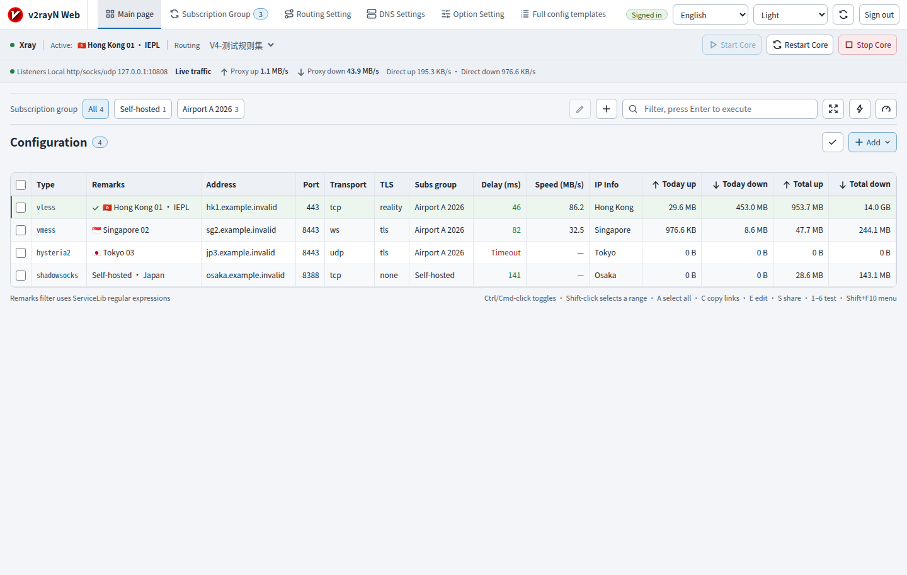
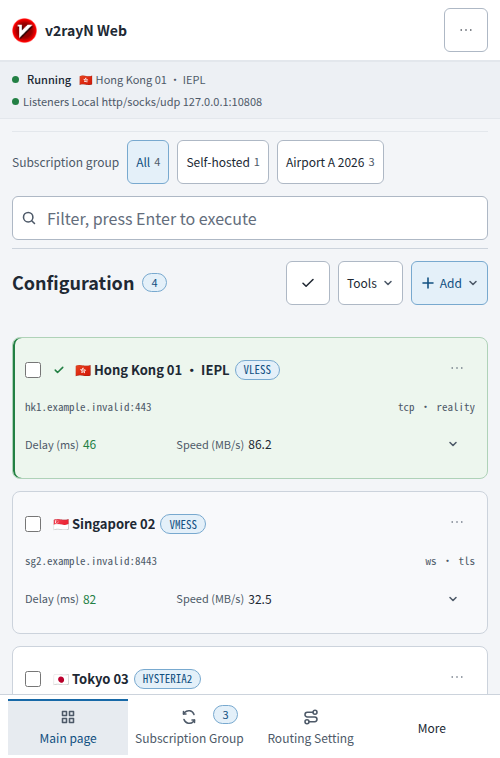

# v2rayN WebUI

This repository contains one WebUI implementation for the v2rayN Web API. It is an
independently developed Vue application; it is **not** part of the API contract and the API
does not require Vue, Vite, Node.js, or this UI to start.

The Backend is `v2rayN.Web` in [Nozilla-X/v2rayN](https://github.com/Nozilla-X/v2rayN).
The frontend and Backend are independently versioned and released.

## Development

Requirements: Node.js 22 or later and npm.

```sh
npm ci
npm test
npm run typecheck
npm run build
```

To use a locally running API while developing, start the Vite server and point its development
proxy at the API. The default target is `http://127.0.0.1:5080`; override it when needed:

```sh
VITE_API_TARGET=http://127.0.0.1:5080 npm run dev
```

The browser always calls same-origin `/api/...` and `/api/events` URLs. Only Vite's development
server proxies `/api` to the configured target; production builds do not embed an API origin
and need no CORS configuration.

## Build and install

Download `v2rayN-WebUI.zip` from a [Release](https://github.com/Nozilla-X/v2rayN-WebUI/releases)
and extract its contents into `webui/` beside the Backend executable, or into its configured
WebUI directory:

```sh
mkdir -p webui
unzip v2rayN-WebUI.zip -d webui
```

The ZIP has no enclosing `dist/` directory. The installed WebUI consists only of static files;
**Node.js is needed for development/building, not at runtime**. You can replace or upgrade the
WebUI independently without replacing the Backend.

To build the same static site from source:

```sh
npm run build
```

The deployable artifact is `dist/`:

```text
dist/
├── index.html
└── assets/**
```

Copy the *contents* of `dist/` into the API's configured WebUI directory (the default is
`webui/` beside the API executable):

```sh
mkdir -p /opt/v2rayn/webui
cp -a dist/. /opt/v2rayn/webui/
```

The API serves the installed static site and uses `index.html` for non-file SPA routes. Replace
or remove the files in `webui/` to change or uninstall this implementation. The API release and
self-update packages do not contain or modify that directory.

## API compatibility

This WebUI requires a compatible `v2rayN.Web` API that provides
the API capabilities `auth.sessions`, `events.sse`, `editor.options`, `profiles`,
`subscriptions`, `routing`, `dns`, `settings`, `backup.restore`, `core.runtime`, `core.updates`,
`web.self-update`, and `static-webui`.

After authentication, `GET /api/status` returns `webVersion`, `gitCommit`, `runtimeIdentifier`,
and `capabilities`; the UI keeps the status response as API data and can use these fields when
checking compatibility. Dynamic protocol/Core/DNS/routing/editor choices come from Backend
option endpoints. The UI does not import or vendor ServiceLib enums, and it does not require a
private WebUI manifest or a separate API version endpoint.

The independently versioned WebUI may not work with every historical Backend build. Pair it
with an API that reports the required capability identifiers and exposes the endpoints above.

## Releases

PRs and pushes to `main` run tests, type checking and the production build without creating a
Release. A stable `vX.Y.Z` tag, or a manual CI run with `release_tag`, publishes the verified
`v2rayN-WebUI.zip`. Before tagging, update `package.json` and the lockfile to `X.Y.Z` and add its
entry to [CHANGELOG.md](CHANGELOG.md). The workflow automatically reads that entry for Release
Notes; missing notes or inconsistent versions fail the release.

## Screenshots

<!-- Screenshots are stored in docs/screenshots and are captured from this repository's build. -->

### Desktop



### Mobile



## License

This project follows the v2rayN repository's GPL-3.0-or-later license. See [LICENSE](LICENSE).

The icon/image assets `Public/NotifyIcon1.ico`, `Public/NotifyIcon2.ico` and
`Public/v2rayN.png` are reused from [v2rayN](https://github.com/2dust/v2rayN).
Their original authors retain copyright; this WebUI does not claim original authorship.
